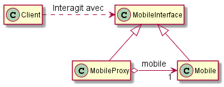

\newpage

# Introduction

Le sujet de ce projet est la mise en place d'une simulation de monde composé de divers objets. On fait donc appel à la programmation objet et nous avons choisi le C++ pour l'implémentation. Les objets qui composent ce monde pourront être statiques, comme les végétaux, ou mobiles. Un certain nombre d'interactions seront possibles avec le monde : le déplacement des mobiles, le passage des saisons qui affectera les végétaux, l'agrandissement de ces derniers et enfin, l'affichage du contenu de notre monde.

L'objectif, au-delà de la mise en place de cette simulation, est de se familiariser avec les design patterns et autres bonnes méthodes de développement pour être en mesure de les reproduire dans des cas plus concrets. Cela inclut, bien sûr, la modélisation de notre application par les diagrammes de classes UML.

\newpage

# Résultats des TPs

## Présentation générale

On présente ici un diagramme de classe simplifié afin d'obtenir une vision globale. Un diagramme complet contenant l'ensemble des méthodes et des attributs est disponibles en annexe.


Une fois le monde créé comme souhaité (avec ses composants végétaux et mobiles), les interactions disponibles s'effectuent de deux façons différentes :

* Les méthodes pour grandir un arbre, pour passer une saison, et pour afficher le contenu du monde utilisent le pattern Commande. On enregistre ces Commandes au niveau du monde et on peut ensuite toutes les exécuter à la suite.

* La méthode de déplacement des mobiles n'est en revanche pas une Commande. On utilise la méthode de déplacement déjà disponible de la classe GroundVehicule et c'est donc le pattern Adaptateur qui permet cette opération.

## Remarques sur chaque partie

Dans cette partie, nous expliquerons les choix que nous avons faits lorsqu'il y avait lieu d'en faire ainsi que les difficultés que nous avons pu rencontrer. Nous ne discuterons pas des résultats obtenus, qui correspondent à chaque partie aux résultats qui étaient attendus en TP. Ces résultats sont, de plus, disponibles en Annexe.

### Partie 1

Cette partie ne nous a pas posé de problèmes liés à la conception, qui avait en plus bien été expliquée durant le TP. Il nous a par contre fallu un peu de temps pour nous ré-habituer au langage C++ avec lequel nous avons choisi de développer cette simulation.

Pour enregistrer l'association entre le type d'arbre et son ArbreType, nous avons choisi d'utiliser une map. Celle-ci associe à un type d'arbre (une chaîne de caractères) un pointeur vers l'ArbreType correspondant.

### Partie 2

Nous devions ici faire un choix concernant le calcul des coordonnées d'un mobile porté et sur le lien entre un porté et son porteur.
Nous avons choisi de travailler avec des coordonnées relatives. Ainsi, avec un Mobile Vélo en (100, 100), un Mobile X s'affichant en (110, 120) sur le Velo a pour coordonnées (10, 20). De plus, nous avons choisi que le lien entre porteur et porté soit unidirectionnel. Un MobilePorteur n'est donc pas accessible depuis ses portés.

Cela signifie que la méthode dessiner() d'un MobilePorteur appelle la méthode dessiner() de ses portés en leur transmettant ses coordonnées et son nom. Les coordonnées transmises sont additionnées aux coordonnées "locales". Les paramètres par défaut du C++ nous permettent de faire fonctionner cette méthode en toutes circonstances en fixant par défaut les coordonnées reçues à 0.

\newpage

Méthode dessiner() de MobilePorteur :

```c++
void MobilePorteur::dessiner(double xx, double yy, std::string porteur) const
{
    std::cout << "Mobile Porteur : " << this->get_nom() << " (" << this->get_x()+xx << ", " << this->get_y()+yy << ")";
    if(porteur.length() > 0)
        std::cout << " sur " << porteur;
    std::cout << std::endl;

    for(size_t i = 0; i < mobiles_portes.size(); i++)
        mobiles_portes[i]->dessiner(this->get_x()+xx, this->get_y()+yy, this->get_nom());
}
```

Méthode dessiner() de MobileSimple :

```c++
void MobileSimple::dessiner(double xx, double yy, std::string porteur) const
{
    std::cout << "Mobile Simple : " << this->get_nom() << " (" << this->get_x()+xx << ", " << this->get_y()+yy << ")";
    if(porteur.length() > 0)
        std::cout << " sur " << porteur;
    std::cout << std::endl;
}
```

Même si nous n'en avons pas eu besoin en TP, le fait de ne pas pouvoir remonter à son porteur pourrait être un inconvénient. Si cela venait à être le cas, nous ajouterions à la classe Mobile un attribut MobilePorteur* porteur.
Par exemple, le calcul de la position absolue d'un Mobile doit nécessairement passer par les porteurs successifs depuis le monde.


Nous avons également développé des constructeurs par copie de MobileSimple vers MobilePorteur et réciproquement afin de faciliter le passage de l'un à l'autre. On fait néanmoins attention à ne pas permettre la transformation de MobilePorteur vers MobileSimple s'il porte des éléments.


### Partie 3

Telle que nous l'avons implémenté, la Commande Saison a un pointeur "cible" vers un GestionnaireArbreType. Or, celui-ci est accessible via la classe Monde, elle-même accessible par tous en tant que singleton. Ce lien entre la Commande Saison et le GestionnaireArbreType n'est donc pas indispensable.


### Partie 4

Nous n'avons eu aucun souci ici pour mettre en place le design pattern Adaptateur et utiliser la classe GroundVehicle.
On peut toutefois noter qu'avec notre implémentation, chaque Mobile (via l'adaptateur) est associé à un GroundVehicle par un lien de composition. Or, on pourrait tout à fait instancier un unique GroundVehicle lié aux mobiles par un lien d'agrégation. En effet, la méthode déplacer() s'assure de placer le GroundVehicle sur les coordonnées du Mobile avant d'effectuer le déplacement. Cette procédure est donc tout à fait compatible au passage à un unique GroundVehicle pour la gestion des déplacements de tous les Mobile.


Méthode deplacer() de la classe AdaptativeGVSimple :

```c++
void AdaptativeGVsimple::deplacer(double angleDeg)
{
    this->GV.set_x(this->get_x());
    this->GV.set_y(this->get_y());

    this->GV.move(angleDeg*M_PI/180);

    this->set_x(GV.get_x());
    this->set_y(GV.get_y());
}
```

### Partie 5

Nous avions une petite difficulté au niveau de l'affichage de Fruit et de Neige. En effet, ces derniers doivent afficher le type de l'objet qu'ils décorent (des arbres en l’occurrence). Or, ils ne contiennent qu'un pointeur vers la classe abstraite Vegetal, et il est impossible de remonter aux classes dérivées pour afficher le nom de la classe réellement instanciée.

Pour palier à ce problème, nous avons défini une méthode virtuelle dessiner_simple() dans la classe Vegetal. Cette méthode est (et doit être) implémentée par chacune des classes dérivées finales de Vegetal (dans notre cas : Arbre, Fruit et Neige). Cette méthode se contentera d'afficher le nom de l'objet ainsi que sa position. On appelle donc désormais la méthode dessiner_simple() depuis la méthode dessiner() des dérivées de VegetalDecore (Fruit et Neige). Cette méthode est appelée sur la cible qui est un Vegetal, la méthode est virtuelle à ce niveau, elle va donc remonter aux classes dérivées, chacune d'entre elles ayant redéfini la méthode pour afficher son type.


Méthode dessiner() de Fruit faisant appel à la méthode dessiner_simple() de Vegetal :

```c++
void Fruit::dessiner() const
{
    this->v->dessiner();
    std::cout << "+ Ajout du decor FRUITS sur ";
    this->v->dessiner_simple();
    std::cout << std::endl;
}
```

Méthode dessiner_simple() de la classe Arbre :

```c++
void Arbre::dessiner_simple() const
{
    std::cout << "arbre (" << this->get_x() << ", " << this->get_y() << ")" << std::endl;
}
```


# Partie 6 - Le partage de Monde en réseau

On détaillera, dans cette partie, les choix de modélisations effectués en réponse à la connexion de classes Monde en réseau. On présentera d'abord le patron de conception choisi, puis nous décrirons comment nous l'avons intégré à notre système, notamment au travers d'un schéma UML.

<!-- Evite de tout charger en mémoire, ne charge que quand nécessaire -->

## Patron de conception

Parmi les différents design patterns auxquels nous avons pensé, un s'est clairement distingué : le proxy.

Dans sa forme la plus générale, le proxy est une classe fonctionnant comme une interface vers autre chose. Toute interaction avec un objet se fera de façon indirecte via le proxy. Le passage par cet intermédiaire est totalement transparent pour l'utilisateur, car les classes du proxy et de l'objet réel vont implémenter la même classe abstraite qui sert d'interface.


Comme on le voit sur ce schéma, les clients (utilisateurs) vont uniquement interagir via une classe ObjetInterface dont héritent les deux classes ObjetProxy et Objet. Les appels à l'interface sont redirigés vers la classe ObjetProxy, dont tous les objets du client local comme des clients distants ont une instance. Si les droits d'accès sont confirmés, les modifications sont acceptées et, si besoin, redirigées vers l'objet réel (classe Objet).

Ce pattern répond extrêmement bien à notre problématique car il va permettre de résoudre deux importants problèmes liés au partage du Monde :

### Procurations de protection

Tout d'abord, il permet de contrôler l'accès aux méthodes de la classe substituée. Les appels des méthodes de ObjetInterface sont redirigés vers l'ObjetProxy correspondant. Si le client est l'utilisateur local, on lui autorise l'accès aux objets ayant une instance Objet, qui sont les objets locaux. Les modifications sont alors acceptées sur l'ObjetProxy et transmises à la classe Objet. En revanche, l'utilisateur local se verra refuser l'accès aux ObjetProxy non instanciés comme Objet en local. Seul le serveur, en transmettant les informations des utilisateurs distants, pourra modifier ces ObjetsProxy qui représentent les Objets des autres utilisateurs. Enfin, les utilisateurs distants, à l'inverse de l'utilisateur local, ne pourront modifier que les ObjetProxy non instanciés comme Objet en local.

### Procurations à distance

De plus, il permettra à notre programme de communiquer à travers le réseau sans que cela soit visible pour l'utilisateur. Ainsi, s'il appelle une méthode nécessitant des informations que seul le serveur ou un autre utilisateur possède, cette requête pourra être transmise à ce dernier par la classe proxy et ainsi permettre la récupération de cette information sans que l'utilisateur n'en ait conscience.

## Intégration au sein du système

Dans notre cas, le design pattern proxy sera mit en place 2 fois. En effet, les classes Vegetal et Mobile, qui sont à la base de tous les objets instanciés dans le monde, auront chacune leur proxy. Ainsi, les classes VegetalProxy et Vegetal hériteront toutes les deux d'une même classe abstraite VegetalInterface. Il en va de même pour les Mobile, avec les classes MobileProxy et MobileInterface. Les utilisateurs n’interagiront qu'avec les classes VegetalInterface et MobileInterface.




Les méthodes des classes proxy feront appel aux méthodes correspondantes dans les classes "réelles" (lorsque les droits sont confirmés). Elles effectueront toutefois des actions supplémentaires : d'abord un contrôle du droit d'accès, et ensuite, le cas échéant, une communication de mise à jour vers le serveur. Par exemple, après l'appel à la méthode deplacer() de la classe réelle, la méthode deplacer() du proxy devra communiquer avec le serveur pour transmettre les nouvelles coordonnées aux autres clients.

La transmission des mises à jour de l'état des objets au serveur est une action récurrente qui doit être effectuée par toutes les méthodes qui modifient l'état d'un objet. Nous avons peu de méthodes concernées ici mais en prévision de l'intégration à un cas plus concret, on peut implémenter une méthode update(). Cette méthode serait chargée de la transmission de l'état de l'objet au serveur et serait appelée par exemple à la fin de la méthode deplacer(). De la même manière, les contrôles de droits d'accès seront récurrents et on mettra en place une méthode dédiée.

On aura donc besoin d'un identifiant unique pour distinguer les utilisateurs et vérifier leurs droits d'accès à un objet. Cet ID utilisateur sera stocké comme attribut du Monde et sera initialisé par le serveur lorsque le Monde se connecte en réseau. Ainsi, on pourra s'assurer que l'identifiant est unique. De plus, la classe ObjetInterface aura elle aussi un attribut ID correspondant à celui de son Monde propriétaire.

Enfin, les ObjetProxy auront un pointeur vers leur équivalent réel. Ce pointeur indiquera la cible vers laquelle rediriger les appels de méthodes et sera initialisé à NULL (nullptr) pour les objets d'utilisateurs distants.

Pour finaliser la mise en place du pattern, on pensera à supprimer les méthodes d'accès aux listes des objets réels du Monde pour les remplacer par des accès aux listes d'ObjetInterface. En effet, toutes les interactions avec les objets réels (Mobile et Vegetal) doivent maintenant passer par les contrôles mis en place dans les classes Proxy puis, si autorisées, être redirigées vers la cible réelle.


\newpage

# Conclusion

Le travail fournit permet le fonctionnement de ce simulateur. Néanmoins, comme il l'est précisé dans l'introduction, l'objectif principal n'est pas le développement mais de s'interroger sur la modélisation de notre système. En cela, cet enseignement nous offre de bonnes pratiques de programmation.

En effet, les motifs de conceptions nous permettent de répondre facilement et efficacement à des problèmes courant rencontrés lors du développement. Ils offrent également une communication plus facile entre développeurs puisqu'ils permettent d'échanger l'architecture globale d'un projet sans avoir à rentrer dans les détails de chaque classe.

De plus, il nous a fait prendre conscience de l'importance de la modélisation et de lui accorder du temps. Elle permet non seulement de réfléchir à l'architecture globale afin de la perfectionner, mais surtout, elle évite de se retrouver bloquer en cours de développement en raison d'un mauvais choix d'architecture. Enfin, tout comme les motifs de conception, elle permet une meilleure collaboration entre développeurs puisqu'elle offre, généralement au travers de diagrammes UML, une vue globale du projet.


\newpage

# Annexes

## Diagramme de classe complet des parties 1 à 5


\newpage

## Résultats des tests des différentes parties

Dans cette section vous trouverez les tests utilisés pour chacune des parties ainsi que les résultats obtenus.

### Partie 1

```c++
void Monde::test_TP1()
{
   this->add_vegetal(new Arbre("sapin", 1, 2, 3));
   this->add_vegetal(new Arbre("chene", 1, 2, 3));
   this->add_vegetal(new Arbre("sapin", 5, 50, 3));
   this->add_vegetal(new Arbre("peuplier", 10, 20, 30));

   this->dessinerTout();
}
```


### Partie 2

```c++
void Monde::test_TP2()
{
   MobileSimple * homme = new MobileSimple("homme", 20, 10);
   MobileSimple * femme = new MobileSimple("femme", 40, 20);
   MobilePorteur * velo = new MobilePorteur("velo", 200, 100);
   MobilePorteur * bateau = new MobilePorteur("bateau", 2000, 1000);

   this->add_mobile(homme);
   velo->add_mobile(femme);
   this->add_mobile(velo);
   this->dessinerTout();
   std::cout << std::endl;

   velo->set_position(300, 200);
   this->dessinerTout();
   std::cout << std::endl;

   velo->set_position(200, 100);
   this->remove_mobile(velo);
   this->add_mobile(bateau);
   bateau->add_mobile(velo);
   this->dessinerTout();
   std::cout << std::endl;

   this->remove_mobile(homme);
   velo->remove_mobile(femme);
   velo->add_mobile(homme);
   this->add_mobile(femme);
   this->dessinerTout();
   std::cout << std::endl;

   MobileSimple * chaise = new MobileSimple("chaise");
   MobilePorteur * mouton = new MobilePorteur("mouton");

   MobilePorteur * MP = new MobilePorteur(*chaise);
   MobileSimple * MS = new MobileSimple(*mouton);

   MP->add_mobile(MS);
   MS->set_position(10, 20);
   MP->set_position(10, 20);
   MP->dessiner();
}
```


### Partie 3

```c++
void Monde::test_TP3()
{
    this->add_vegetal(new Arbre("sapin", 1, 2, 3));
    this->add_vegetal(new Arbre("chene", 10, 20, 30));
    this->add_vegetal(new Arbre("sapin", 15, 15, 15));

    this->add_commande(new AfficheContenu());

    this->add_commande(new Grandir(2.0));
    this->add_commande(new Saison(this->gat));

    this->add_commande(new AfficheContenu());

    this->execute_cmd();
}
```


### Partie 4

```c++
void Monde::test_TP4()
{
    MobileSimple * homme = new AdaptativeGVsimple("homme", 20, 10);
    MobileSimple * femme = new MobileSimple("femme", 40, 20);
    MobilePorteur * velo = new AdaptativeGVporteur("velo", 200, 100);

    this->add_mobile(homme);
    velo->add_mobile(femme);
    this->add_mobile(velo);
    this->dessinerTout();

    homme->deplacer(0);
    velo->deplacer(90);
    this->dessinerTout();
}
```


### Partie 5

```c++
void Monde::test_TP5()
{
	Arbre* pommier1 = new Arbre("pommier", 50, 1000, 500);
	this->add_vegetal(pommier1);
	Arbre* pommier2 = new Arbre("pommier", 20, 2000, 1500);
	this->add_vegetal(pommier2);
	Arbre* peuplier = new Arbre("peuplier", 5, 3, 3);
	this->add_vegetal(peuplier);

	this->dessinerTout();

    std::cout << "\n[Ajout décors]\n" << std::endl;

	Fruit* pomf = new Fruit(pommier1);
    this->replace_vegetal(pommier1, pomf);

	Fruit* poirf = new Fruit(pommier2);
    this->replace_vegetal(pommier2, poirf);

	Neige* peun = new Neige(peuplier);
	this->replace_vegetal(peuplier, peun);

	this->dessinerTout();
}
```


## Diagramme de classe complet de la partie 6


